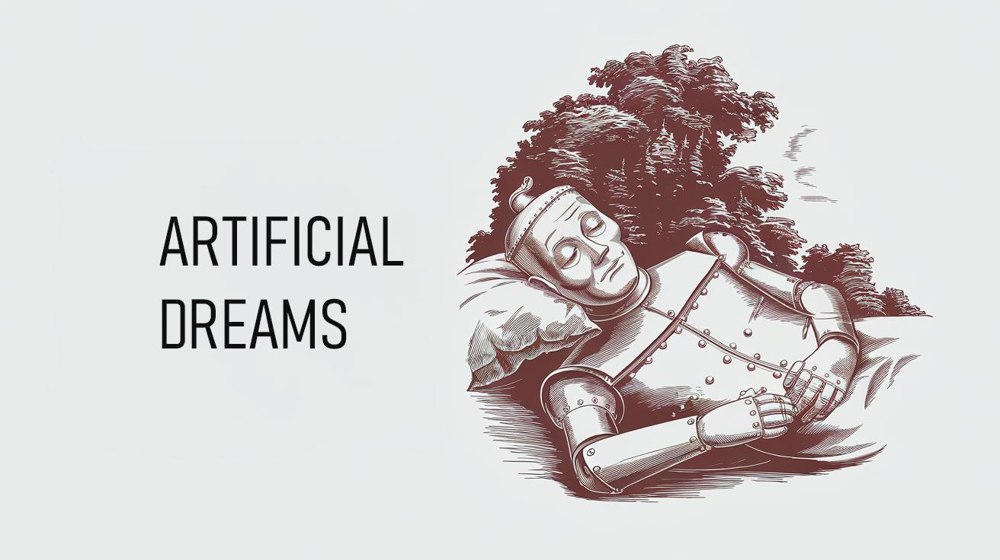

# Artificial Dreams Module

*A component of the Bicameral AGI Project: Memory Consolidation and Hypothetical Scenario Exploration for AI*

## Abstract

This repository implements the Artificial Dreams module, a biologically-inspired approach to memory consolidation and hypothetical scenario exploration for AI systems. Drawing from how human brains process memories during sleep, this module consolidates similar memories, generates potential future scenarios, and derives insights that would otherwise be computationally expensive to explore. The implementation features a dark-themed visualization interface that allows direct observation of the dreaming process as it unfolds.

  
  
Click the image to watch the demo on YouTube

## 1. Introduction

Current AI systems struggle with effective memory management and efficient scenario exploration. Storing every experience verbatim leads to memory redundancy, while processing all potential futures is computationally prohibitive. The Artificial Dreams module addresses these challenges by:

* **Memory Consolidation:** Merging similar low-importance memories to reduce redundancy and extract patterns
* **Hypothetical Scenario Generation:** Exploring possible future outcomes based on observed patterns
* **Insight Formation:** Deriving valuable insights from hypothetical scenarios
* **Optimization:** Automatically determining when dreaming has reached diminishing returns

## 2. Components

The system consists of three primary components:

1. **Memory System (`memory_system.py`)**: 
   - Manages storage of raw memories, consolidated memories, and insights
   - Assigns importance scores to memories based on content, source, and context
   - Identifies similar memories for potential consolidation
   - Provides memory retrieval functionality

2. **Dream System (`dream_system.py`)**:
   - Implements the core dreaming process with multiple stages
   - Applies optimization to prevent endless computation
   - Consolidates similar memories into more abstract representations
   - Generates hypothetical scenarios based on observed patterns
   - Forms insights from scenario exploration

3. **Web Interface**:
   - Visualizes the entire dreaming process in real-time
   - Provides day generation functionality to create test memories
   - Shows memory consolidation, scenario generation, and insight formation
   - Allows exploration of memory storage and dream records

## 3. Operational Mechanics

The dreaming process follows these stages:

1. **Memory Selection**:
   - Identifies low-importance memories for consolidation
   - Detects patterns and similarities across memories
   - Prioritizes memories for processing

2. **Consolidation**:
   - Merges similar memories into single representations
   - Preserves essential details while reducing redundancy
   - Records consolidated memories with enhanced importance

3. **Hypothesis Generation**:
   - Creates "what if" scenarios based on observed patterns
   - Evaluates probability and relevance of each scenario
   - Explores potential future situations and outcomes

4. **Insight Formation**:
   - Analyzes hypothetical scenarios for valuable learnings
   - Generates abstract insights that can be applied broadly
   - Stores high-value insights for future reference

5. **Optimization**:
   - Evaluates the marginal benefit of continuing the dream
   - Terminates early when diminishing returns are detected
   - Balances thoroughness with computational efficiency

## 4. Example Scenario

Imagine an AI assistant that processes daily interactions:

* **Repeated Event:** The AI records multiple interactions with the same person in different locations throughout the day (e.g., "Met Taylor at the coffee shop" and "Saw Taylor again in the elevator").
* **Memory Consolidation:** During dreaming, the AI consolidates these separate encounters into a generalized memory like "Encountered Taylor multiple times today in different locations."
* **Hypothetical Scenarios:** The dreaming process might generate scenarios such as "What if I encounter Taylor again tomorrow?" or "What if Taylor is a regular part of daily routines?"
* **Insight Formation:** From these scenarios, the AI might derive insights like "Regular encounters with the same people indicate important social connections" or "Recognizing recurring individuals quickly would improve interaction efficiency."
* **Learning:** These insights can then inform future behavior, such as prioritizing recognition of frequently encountered individuals.

## 5. Current Implementation

This implementation demonstrates:

- Intelligent memory consolidation that detects and merges similar events
- Sophisticated visualization of the dreaming process with animated stages
- Self-optimizing dream cycles that terminate when the benefit diminishes
- Day generator for simulating experiences and testing memory consolidation
- Dark-themed interface for monitoring memory organization and dream progression

## 6. Future Improvements

While the current implementation demonstrates the core concepts, several improvements could enhance its capabilities:

* **Embedding Improvements**: Integration with more advanced embedding models for better similarity detection
* **Context-Aware Consolidation**: Considering temporal and causal relationships between memories
* **Adaptive Importance Scoring**: Dynamic adjustment of memory importance based on changing goals
* **Multi-Modal Memories**: Support for processing different memory types (text, images, etc.)
* **Interactive Dreaming**: Allowing guided dream exploration to solve specific problems
* **Long-Term Memory Architecture**: Integration with forgetting mechanisms and long-term storage
* **Performance Optimization**: Parallel processing for memory consolidation and scenario generation
* **Memory Networks**: Graph-based representation of memory relationships
* **External Knowledge Integration**: Incorporating external knowledge sources to enhance scenarios
* **Emotional Valence**: Reintroducing emotional factors in memory importance (optional)
